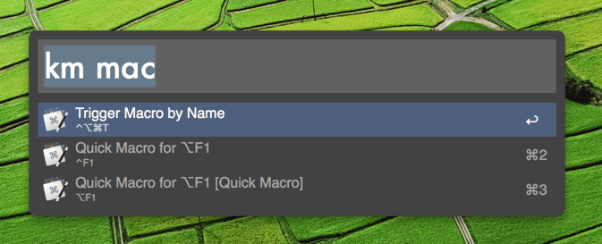

# Alfred Maestro (Enhanced)

> **Note**: This is a significantly enhanced fork of [iansinnott/alfred-maestro](https://github.com/iansinnott/alfred-maestro).

Trigger **any** Keyboard Maestro macro directly from Alfred, instantly.

Unlike the original workflow which required background syncing scripts or static files, **this version communicates directly with the Keyboard Maestro Engine in real-time**.

## ✨ Key Features (New in v0.3.0)

*   ⚡️ **Instant Updates**: New macros appear in Alfred immediately (1-second cache). No external sync scripts required.
*   🔎 **Search Everything**: Finds **all** macros, including those without hotkeys assigned.
*   ⌨️ **Rich Display**: Shows assigned Hotkeys and Typed String triggers directly in the subtitle.
*   🚀 **New Modifiers**:
    *   `Type` `km` `Macro Name` to search.
    *   **Enter**: Run the macro.
    *   **Option (⌥) + Enter**: **Execute with Parameter** (Prompts you to enter text, then passes it to the macro).
    *   **Control (⌃) + Enter**: **Copy Shell Command** (Copies the `osascript` command to trigger this macro from the terminal).
    *   **Command (⌘) + Enter**: **Reveal** the macro in the Keyboard Maestro editor.

## Requirements

*   [Alfred 5](https://www.alfredapp.com/) (with Powerpack)
*   [Keyboard Maestro](https://www.keyboardmaestro.com/)

## Installation

1.  Download the latest [AlfredMaestro.alfredworkflow](./AlfredMaestro.alfredworkflow) release.
2.  Double-click to install.

## Usage

Simply type `km` followed by the macro name.

### Actions

| Key | Action |
| --- | --- |
| **Enter** | **Run** the macro immediately. |
| **⌥ Enter** | **Run with Parameter**. A dialog will appear asking for input. |
| **⌃ Enter** | **Copy Shell Command**. Copies `osascript -e ...` to clipboard. |
| **⌘ Enter** | **Edit**. Opens the macro in Keyboard Maestro. |

## Credits

Original workflow by [Ian Sinnott](http://iansinnott.com).
Enhanced version maintained by [Chris Lapointe].
