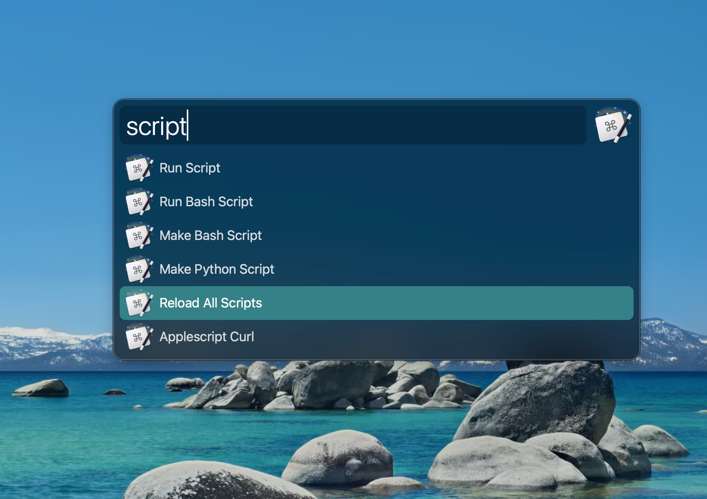

# Alfred Maestro (Enhanced)

> **Note**: This fork extends the workflow by [iansinnott/alfred-maestro](https://github.com/iansinnott/alfred-maestro) with dynamic data fetching and additional modifiers.

Trigger **any** Keyboard Maestro macro directly from Alfred.

## Differences in this Fork

This fork builds upon the excellent foundation laid by [Ian Sinnott](http://iansinnott.com), adding new action modifiers and improving update speed.

| Feature | Original (v0.2.x) | This Fork (v0.3.x) |
| :--- | :--- | :--- |
| **Updates** | 15-second cache. | **Instant**: 1-second cache. |
| **Actions** | Run, Reveal. | **Run**, **Reveal**, **With Param**, **Copy Shell Command**. |
| **Data Source** | Dynamic (AppleScript). | **Dynamic**: Improved parsing. |

## Key Features

*   **Instant Updates**: New macros appear in Alfred immediately.
*   **Search Everything**: Finds all macros, including those without hotkeys assigned.
*   **Rich Display**: Shows assigned Hotkeys and Typed String triggers directly in the subtitle.

## Requirements

*   [Alfred 5](https://www.alfredapp.com/) (with Powerpack)
*   [Keyboard Maestro](https://www.keyboardmaestro.com/)

## Installation

1.  Download the latest [AlfredMaestro.alfredworkflow](./AlfredMaestro.alfredworkflow) release.
2.  Double-click to install.

## Usage

Simply type `km` followed by the macro name.

### Actions / Modifiers

| Key | Action |
| --- | --- |
| **Enter** | **Run** the macro immediately. |
| **Cmd + Enter** | **Run with Parameter**. Prompts for input text. |
| **Control + Enter** | **Copy Shell Command**. Copies `osascript` trigger to clipboard. |
| **Shift + Enter** | **Copy CLI Command**. Copies `keyboardmaestro <UID>` to clipboard. |
| **Option + Enter** | **Reveal**. Opens the macro in Keyboard Maestro. |

## Credits

Original workflow by [Ian Sinnott](http://iansinnott.com).
Enhanced version maintained by [DiggingForDinos](https://github.com/DiggingForDinos).
